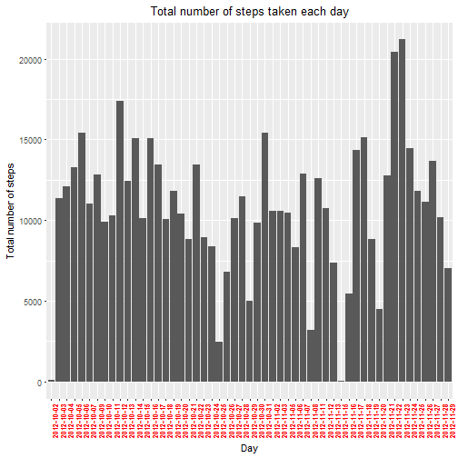
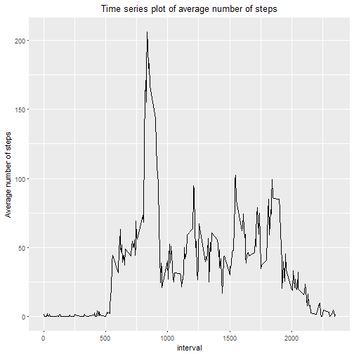
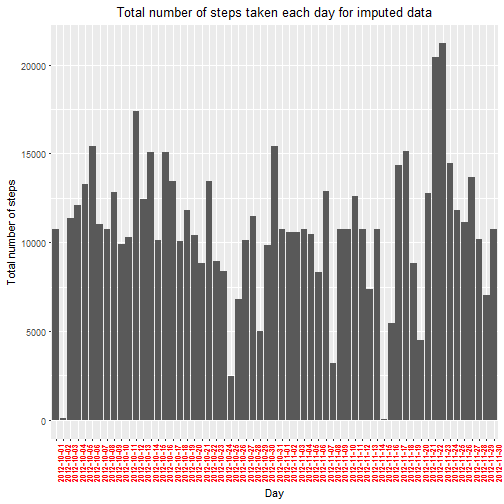
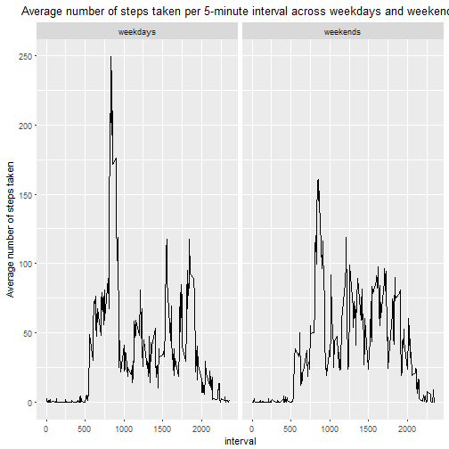

## Load the dataset


```r
data <- read.csv("activity.csv")
str(data)
```

```
## 'data.frame':	17568 obs. of  3 variables:
##  $ steps   : int  NA NA NA NA NA NA NA NA NA NA ...
##  $ date    : Factor w/ 61 levels "2012-10-01","2012-10-02",..: 1 1 1 1 1 1 1 1 1 1 ...
##  $ interval: int  0 5 10 15 20 25 30 35 40 45 ...
```

## Removings rows corresponding to date that have missing steps data


```r
library(dplyr)
condition <- data %>% group_by(date) %>% summarise(count_NA = sum(!is.na(steps)))
sub <- data[!(data$date %in% (condition$date[condition$count_NA == 0])),]
str(sub)
```

```
## 'data.frame':	15264 obs. of  3 variables:
##  $ steps   : int  0 0 0 0 0 0 0 0 0 0 ...
##  $ date    : Factor w/ 61 levels "2012-10-01","2012-10-02",..: 2 2 2 2 2 2 2 2 2 2 ...
##  $ interval: int  0 5 10 15 20 25 30 35 40 45 ...
```

```r
sum(is.na(sub$steps))
```

```
## [1] 0
```

## Histogram of the total number of steps taken each day


```r
library(ggplot2)
grouped_sum_data <- sub %>% group_by(date) %>% summarise(sum = sum(steps))

ggplot(grouped_sum_data, aes(date,sum)) + 
geom_histogram(stat = "identity") + 
theme(axis.text.x = element_text(angle = 90, face = "bold", colour = "red", size = 8)) + 
labs(title = "Total number of steps taken each day", x = "Day", y = "Total number of steps") +
theme(plot.title = element_text(hjust = 0.5))
```

```
## Warning: Ignoring unknown parameters: binwidth, bins, pad
```



## Mean and median number of steps taken each day


```r
grouped_mean_median_data <- sub %>% group_by(date) %>% summarise(mean = mean(steps), median = median(steps))
grouped_mean_median_data
```

## Time series plot of the average number of steps taken 


```r
grouped_mean_interval <- data %>% group_by(interval) %>% summarise(mean = mean(steps, na.rm = T))

ggplot(grouped_mean_interval,aes(interval,mean)) + 
geom_line() + 
ylab("Average number of steps") + 
ggtitle("Time series plot of average number of steps") +
theme(plot.title = element_text(hjust = 0.5))
```



## The 5-minute interval that, on average, contains the maximum number of steps


```r
grouped_mean_interval$interval[which(grouped_mean_interval$mean == max(grouped_mean_interval$mean))]
```

```
## [1] 835
```

## Code to describe and show a strategy for imputing missing data


```r
# sub is a subset of dataset data with no missing values
# grouped_mean_interval is dataframe with mean values of steps for each interval
# Now, imputing NA values for rows corresponding to its interval
# creating a copy of dataset data namely newdata
newdata <- data 
sum(is.na(newdata$steps))
```

```
## [1] 2304
```

```r
newdata$steps[which(is.na(newdata$steps))] = rep(grouped_mean_interval$mean,8)
sum(is.na(newdata$steps))
```

```
## [1] 0
```

```r
# newdata is a dataset with imputed missing data
```

## Histogram of the total number of steps taken each day after missing values are imputed


```r
imputed_grouped_sum_data <- newdata %>% group_by(date) %>% summarise(sum = sum(steps))

ggplot(imputed_grouped_sum_data, aes(date,sum)) + 
geom_histogram(stat = "identity") + 
theme(axis.text.x = element_text(angle = 90, face = "bold", colour = "red", size = 8)) + 
labs(title = "Total number of steps taken each day for imputed data", x = "Day", y = "Total number of steps") + 
theme(plot.title = element_text(hjust = 0.5))
```

```
## Warning: Ignoring unknown parameters: binwidth, bins, pad
```



## Panel plot comparing the average number of steps taken per 5-minute interval across weekdays and weekends


```r
newdata$date <- as.Date(as.character(newdata$date))

weekday <- c("Monday", " Tuesday", "Wednesday", "Thursday", "Friday")
weekend <- c("Sunday", "Saturday")

newdata_weekdays_weekends <- newdata %>% mutate(weekdays_weekends = ifelse(as.character(weekdays(newdata$date)) %in% weekday, "weekdays", "weekends"))

plot_across_weekdays_weekends <- newdata_weekdays_weekends %>% group_by(weekdays_weekends, interval) %>% summarise(mean = mean(steps))

ggplot(plot_across_weekdays_weekends,aes(interval,mean)) + 
geom_line() +
facet_grid(.~factor(weekdays_weekends)) +
ggtitle("Average number of steps taken per 5-minute interval across weekdays and weekends") + 
theme(plot.title = element_text(hjust = 0.5)) + 
ylab("Average number of steps taken")
```



